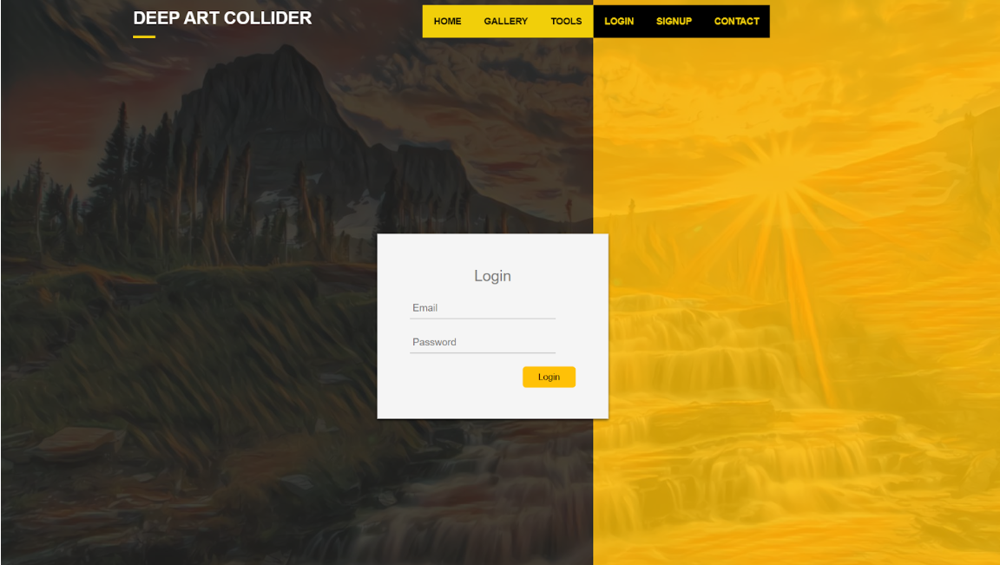
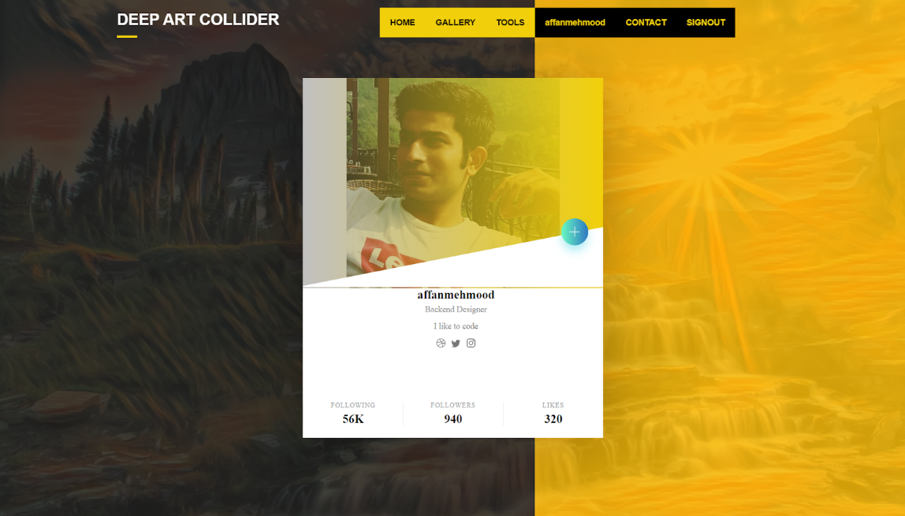

# ArtColider
This App allows users to collaborate and create art. User can post a picture on their profile
apply filters using the given tools, and use other people's public art to transfer that style into their own 
image using StyleGans  
**A few of the screenshots are as following:**

   Home Page            
:-------------------------:

   Login            
:-------------------------:

   Profile            
:-------------------------:

   Tools            
:-------------------------:

